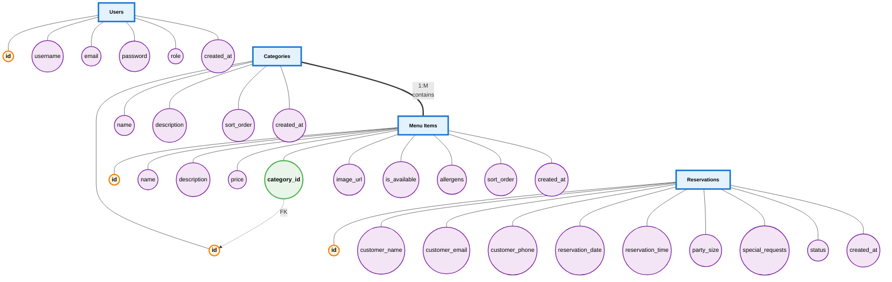

```mermaid
graph TD
    Users["Users"]

    users_id(("id"))
    users_username(("username"))
    users_email(("email"))
    users_password(("password"))
    users_role(("role"))
    users_created_at(("created_at"))

    Categories["Categories"]

    categories_id(("id"))
    categories_name(("name"))
    categories_description(("description"))
    categories_sort_order(("sort_order"))
    categories_created_at(("created_at"))

    MenuItems["Menu Items"]

    menu_id(("id"))
    menu_name(("name"))
    menu_description(("description"))
    menu_price(("price"))
    menu_category_id(("category_id"))
    menu_image_url(("image_url"))
    menu_is_available(("is_available"))
    menu_allergens(("allergens"))
    menu_sort_order(("sort_order"))
    menu_created_at(("created_at"))

    Reservations["Reservations"]

    res_id(("id"))
    res_customer_name(("customer_name"))
    res_customer_email(("customer_email"))
    res_customer_phone(("customer_phone"))
    res_reservation_date(("reservation_date"))
    res_reservation_time(("reservation_time"))
    res_party_size(("party_size"))
    res_special_requests(("special_requests"))
    res_status(("status"))
    res_created_at(("created_at"))

    Users --- users_id
    Users --- users_username
    Users --- users_email
    Users --- users_password
    Users --- users_role
    Users --- users_created_at

    Categories --- categories_id
    Categories --- categories_name
    Categories --- categories_description
    Categories --- categories_sort_order
    Categories --- categories_created_at

    MenuItems --- menu_id
    MenuItems --- menu_name
    MenuItems --- menu_description
    MenuItems --- menu_price
    MenuItems --- menu_category_id
    MenuItems --- menu_image_url
    MenuItems --- menu_is_available
    MenuItems --- menu_allergens
    MenuItems --- menu_sort_order
    MenuItems --- menu_created_at

    Reservations --- res_id
    Reservations --- res_customer_name
    Reservations --- res_customer_email
    Reservations --- res_customer_phone
    Reservations --- res_reservation_date
    Reservations --- res_reservation_time
    Reservations --- res_party_size
    Reservations --- res_special_requests
    Reservations --- res_status
    Reservations --- res_created_at

    Categories ===|"1:M<br/>contains"| MenuItems
    menu_category_id -.->|"FK"| categories_id

    Users ~~~ Categories
    MenuItems ~~~ Reservations
    Users ~~~ MenuItems
    Categories ~~~ Reservations

    classDef entity fill:#e3f2fd,stroke:#1976d2,stroke-width:4px,color:#000,font-weight:bold,font-size:14px
    classDef primaryKey fill:#fff3e0,stroke:#f57c00,stroke-width:3px,color:#000,font-weight:bold
    classDef foreignKey fill:#e8f5e8,stroke:#4caf50,stroke-width:3px,color:#000,font-weight:bold
    classDef attribute fill:#f3e5f5,stroke:#7b1fa2,stroke-width:2px,color:#000

    class Users,Categories,MenuItems,Reservations entity
    class users_id,categories_id,menu_id,res_id primaryKey
    class menu_category_id foreignKey
    class users_username,users_email,users_password,users_role,users_created_at attribute
    class categories_name,categories_description,categories_sort_order,categories_created_at attribute
    class menu_name,menu_description,menu_price,menu_image_url,menu_is_available,menu_allergens,menu_sort_order,menu_created_at attribute
    class res_customer_name,res_customer_email,res_customer_phone,res_reservation_date,res_reservation_time,res_party_size,res_special_requests,res_status,res_created_at attribute
```
